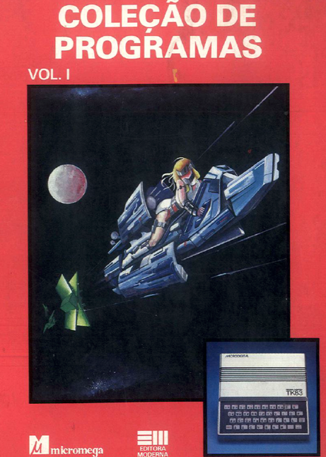
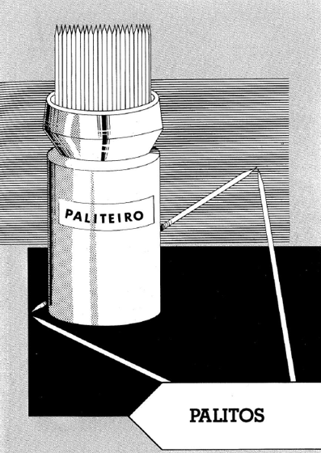
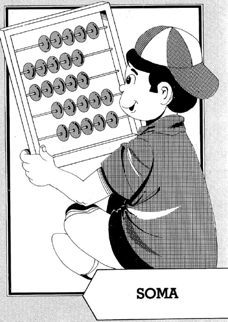

# zx81-colecao-programas
Coleção de Programas ZX-81 Editora Moderna - Volumes 1, 2 e 3

Type-In dos programas dos 3 livros

## Livro 1

### Autor: **Carlos Eduardo Rocha Salvato**
### Publicaçao: **1983 Editora Moderna**
### Criação: **MicroMega**

## Programas
### Palitos

>Este é um jogo qu exige muito raciocínio, pois seu adversário será o computador. Logo após ter digitado "RUN", aparecerão no vídeo 17 palitos: você deverá tirar de 1 a 3  palitos. Ganha o jogo quem tirar o último palito.
* linha 1040 = chr$(133) = "\ :"
* Memória usada: 2100 bytes
* palitos.bas / palitos.bas.p
### Soma

>Este é um programa educativo, que ensina as crianças a efetuar adições. Seu aspecto interessante consiste no fato de eles não se limitarem apenas ao cálculo, mas também optrem pela resposta certa, pois trata-se de um teste de múltipla escolha.
* Linhas 60 e 140 : CHR$(128) : "\::"
* Linhas 80, 100 e 320 : CHR$(5) : "\: "
* Linha 160 : CHR$(143) : "%?"
* Linhas 170 e 280 : CHR$(8) : "\@@"
* Linhas 180 e 330 : CHR$(7) : "\:'"
* Linha 200 : CHR$(10) : "%\!!"
* Memória usada: 1581 bytes
* soma.bas / soma.bas.p

